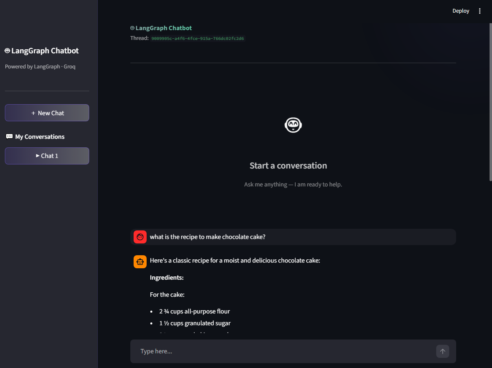

# 🤖 LangGraph Multi-Utility RAG Chatbot

A conversational AI chatbot built with **LangGraph**, **LangChain**, and **Streamlit**, powered by **Groq's ultra-fast inference** (Llama 3.3 70B). Supports persistent multi-turn chat history with **SQLite**, multiple concurrent chat threads, real-time token streaming, document **Retrieval-Augmented Generation (RAG)**, external tools, and an animated UI.

---

## ✨ Features

- 🧠 **Persistent chat memory** — LangGraph \SqliteSaver\ stores message history per thread in \chatbot.db- ⚡ **Tool Calling** — Integrates seamlessly with DuckDuckGo Search, a Stock Price checker, and a Calculator.
- 📄 **RAG / PDF Ingestion** — Upload a PDF in the sidebar; the app uses \FAISS\ and \HuggingFaceEmbeddings\ to index chunks and query the document on demand.
- 💬 **Multiple chat threads** — Create new conversations, switch between threads, and reload previous ones from SQLite.

---

## 🗂️ Project Structure

\chatbot/
├── langraph_rag_backend.py         # LangGraph + Groq backend with Tools & RAG setup
├── streamlit_rag_frontend.py       # Main Streamlit app (RAG, Tools, Threading & SQLite)
├── chatbot.db                      # SQLite database file created/updated at runtime
├── image.png                       # UI screenshot used in README
├── requirements.txt                # Pip-installable dependencies
├── pyproject.toml                  # Project metadata (uv / PEP 517)
├── .env                            # 🔑 API keys (not committed)
└── README.md
\
---

## 🚀 Getting Started

### Prerequisites

- Python **3.12+**
- A free [Groq API key](https://console.groq.com/)

### 1. Clone the repository

\\ash
git clone https://github.com/SahilGG-4545/chatbot.git
cd chatbot
\
### 2. Create and activate a virtual environment

\\ash
# Using uv (recommended)
uv venv
.venv\Scriptsctivate        # Windows
source .venv/bin/activate     # macOS / Linux

# Or using plain venv
python -m venv .venv
.venv\Scriptsctivate
\
### 3. Install dependencies

\\ash
# With uv
uv add -r requirements.txt

# Or with pip
pip install -r requirements.txt
\
### 4. Configure environment variables

Create a \.env\ file in the project root:

\\env
GROQ_API_KEY=your_groq_api_key_here
\
### 5. Run the app

\\ash
streamlit run streamlit_rag_frontend.py
\
Open [http://localhost:8501](http://localhost:8501) in your browser.

---

## 🏗️ Architecture

\User
  |
  v
Streamlit App
  |
  v
LangGraph Flow  <---->  SQLite (chatbot.db)
  |                       |
  v                       v
Groq LLM              FAISS Vectorstore (PDF RAG)
  |
  v
Tools (DuckDuckGo, Stock Quote, Calculator)
\
- Streamlit handles UI state (\	hread_id\, visible messages, conversation switching, and PDF uploads)
- LangGraph orchestrates prompts/responses, manages tool execution, and checkpoints thread state with \SqliteSaver- SQLite keeps conversations durable across app restarts, and the UI can reload historical threads
- Ingested PDFs are loaded into a local FAISS vector store per-thread, enabling document-aware answers.

---

## 💾 Data Persistence

- Chat history is stored in a local SQLite database file: \chatbot.db\ (project root)
- Each conversation is isolated by a unique \	hread_id- Clicking **New Chat** creates a new thread and keeps previous threads available

### Reset Chat History Safely

1. Stop the Streamlit app if it is running
2. (Optional) Back up the database file: copy \chatbot.db\ to another location
3. Delete \chatbot.db4. Run the app again: \streamlit run streamlit_rag_frontend.py
This will create a fresh empty database on startup.

---

## 🛠️ Tech Stack

| Layer | Technology |
|---|---|
| LLM Inference | [Groq](https://groq.com/) — Llama 3.3 70B Versatile |
| Orchestration | [LangGraph](https://github.com/langchain-ai/langgraph) |
| RAG / Chunking | [LangChain](https://github.com/langchain-ai/langchain) + PyPDFLoader |
| Vector Store | [FAISS](https://github.com/facebookresearch/faiss) |
| Embeddings | HuggingFace (\paraphrase-MiniLM-L3-v2\) |
| Persistence | SQLite (\langgraph-checkpoint-sqlite\) |
| Frontend | [Streamlit](https://streamlit.io/) |

---

## 📦 Dependencies

\langgraph
langgraph-checkpoint-sqlite
langchain-core
langchain-openai
langchain-community
faiss-cpu
sentence-transformers
duckduckgo-search
pypdf
python-dotenv
streamlit
\
---

## 🤝 Contributing

1. Fork the repo
2. Create a feature branch: \git checkout -b feat/your-feature3. Commit your changes: \git commit -m 'feat: add your feature'4. Push and open a Pull Request

---

## 📄 License

MIT License — see [LICENSE](LICENSE) for details.
